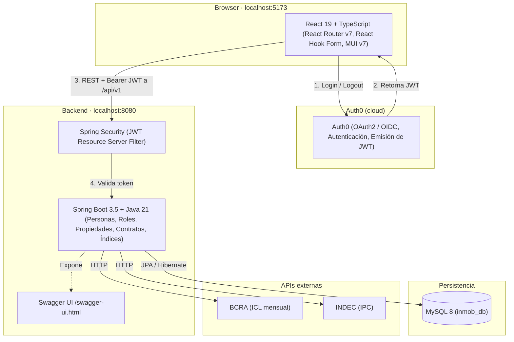

# inmob — Sistema de Gestión Inmobiliaria

> Proyecto académico desarrollado en el marco de la materia **Metodología y Testing**  
> Tecnicatura en Desarrollo de Software — [Instituto Tecnológico Universitario](https://itu.uncuyo.edu.ar), Universidad Nacional de Cuyo

Aplicación web para la gestión de propietarios, inquilinos e inmuebles. Arquitectura fullstack con backend en Spring Boot y frontend en React.

---

## Stack tecnológico

| Capa | Tecnología |
|------|-----------|
| Frontend | React 19, TypeScript, Vite |
| UI | MUI v7 |
| Routing | React Router v7 |
| Formularios | React Hook Form |
| Autenticación | Auth0 |
| Backend | Spring Boot 3.5, Java 21 |
| Seguridad | Spring Security + OAuth2 Resource Server (JWT) |
| Persistencia | Spring Data JPA + MySQL |
| Documentación API | SpringDoc OpenAPI (Swagger UI) |
| Testing (FE) | Vitest + Testing Library, Playwright (e2e) |
| Testing (BE) | Spring Boot Test + H2 (in-memory) |

---

## Arquitectura



Ver diagrama completo: [`docs/diseño/arquitectura.md`](docs/diseño/arquitectura.md)

---

## Cómo funciona

1. El usuario accede al frontend y es redirigido a Auth0 para autenticarse.
2. Auth0 emite un JWT firmado que el frontend almacena y adjunta a cada request como `Authorization: Bearer <token>`.
3. Spring Security valida el JWT contra el issuer de Auth0 antes de dejar pasar la request al controlador.
4. Los controladores delegan en la capa de servicio, que opera sobre las entidades JPA y persiste en MySQL.
5. Los índices económicos (IPC e ICL) se consultan a BCRA/INDEC y se cachean en la base de datos para mostrarse en el dashboard.

---

## Modelo de datos

El modelo central gira en torno a `Persona`, que puede ser física o jurídica y tener múltiples roles (propietario, inquilino, garante, empleado, administrador). Las propiedades se heredan en una jerarquía `Propiedad → UnidadHabitacional → Casa / Departamento` y `Propiedad → Terreno`. Los contratos vinculan propiedades con propietarios, inquilinos y garantes, y registran los ajustes históricos por índice.

- Diagrama ER: [`docs/diseño/er.md`](docs/diseño/er.md)
- Diagrama de clases UML: [`docs/diseño/uml.md`](docs/diseño/uml.md)

---

## Cobertura de tests

| Capa | Tipo | Herramienta | Qué cubre |
|------|------|-------------|-----------|
| Frontend | Unitarios | Vitest + Testing Library | `LoginPage`, `indicesService`, `personasService`, `PropietariosPage`, `InquilinosPage` |
| Frontend | E2E | Playwright | Flujo de autenticación (usuario no autenticado) |
| Backend | Integración | Spring Boot Test + H2 | Repositorios JPA (`PersonaFisicaRepository`) |

Ver plan de pruebas detallado: [`docs/testing/TESTING.md`](docs/testing/TESTING.md)

---

## Decisiones de diseño destacadas

- **Herencia JOINED en JPA** — `Persona`, `Rol` y `Propiedad` usan `InheritanceType.JOINED` para mantener integridad referencial y evitar columnas nulas masivas (descartado `SINGLE_TABLE`).
- **Roles como entidades separadas** — un rol no es un campo en `Persona` sino una entidad propia, lo que permite que una misma persona sea propietario e inquilino simultáneamente.
- **JWT stateless** — el backend no mantiene sesión; toda la identidad y autorización viaja en el token emitido por Auth0.
- **Índices económicos cacheados** — para evitar dependencia en tiempo real de las APIs externas, los valores se persisten en `indice_snapshot` y se actualizan bajo demanda.

---

## Estructura del proyecto

```
inmob/
├── frontend/          # Aplicación React
│   └── src/app/
│       ├── pages/     # Vistas principales
│       ├── components/# Navbar, Sidebar, Layout, AdminRoute, UI
│       ├── hooks/     # useCurrentUser, useIndices
│       ├── services/  # Llamadas a la API (personas, índices, auth)
│       └── data/      # Mock data
├── backend/           # API REST Spring Boot
│   └── src/main/java/com/inmob2/backend/
│       ├── controller/# Endpoints REST (personas, inmuebles, contratos, índices, auth)
│       ├── service/   # Lógica de negocio
│       ├── model/     # Entidades, DTOs, enums
│       ├── repository/# Repositorios JPA
│       └── config/    # SecurityConfig, CorsConfig
└── docs/              # Documentación del proyecto
    ├── diseño/
    │   ├── arquitectura.md
    │   ├── er.md
    │   └── uml.md
    ├── desarrollo/
    │   ├── CONTRIBUTING.md
    │   ├── MOCKING.md
    │   └── auth0-backend-guide.md
    └── testing/
        └── TESTING.md
```

---

## Funcionalidades

- **Autenticación** — login/logout con Auth0, protección de rutas por rol (ADMIN)
- **Propietarios** — listado, alta, edición (personas físicas y jurídicas)
- **Inquilinos** — listado, alta, edición
- **Inmuebles** — listado, alta (casas, departamentos, terrenos)
- **Contratos** — listado, alta, edición
- **Roles** — asignación de roles a personas (propietario, inquilino, garante, empleado, administrador)
- **Índices económicos** — consulta de IPC e ICL actualizados desde API externa, con widget en el dashboard

---

## Requisitos previos

- Node.js 20+
- Java 21
- MySQL 8+ con base de datos `inmob_db`
- Cuenta y aplicación configurada en [Auth0](https://auth0.com)

---

## Configuración y ejecución

### Backend

Configurar la conexión a la base de datos y Auth0 en `backend/src/main/resources/application.yaml`:

```yaml
spring:
  datasource:
    url: jdbc:mysql://localhost:3306/inmob_db
    username: root
    password: <tu_password>
  security:
    oauth2:
      resourceserver:
        jwt:
          issuer-uri: https://<tu-dominio>.auth0.com/
          audiences: <tu-audience>
```

```bash
cd backend
./mvnw spring-boot:run
```

La API queda disponible en `http://localhost:8080`.  
Swagger UI: `http://localhost:8080/swagger-ui.html`

### Frontend

Crear un archivo `.env` en `frontend/` con las variables de Auth0:

```env
VITE_AUTH0_DOMAIN=<tu-dominio>.auth0.com
VITE_AUTH0_CLIENT_ID=<tu-client-id>
VITE_AUTH0_AUDIENCE=<tu-audience>
```

```bash
cd frontend
npm install
npm run dev
```

La app queda disponible en `http://localhost:5173`.

---

## Scripts disponibles (frontend)

| Comando | Descripción |
|---------|-------------|
| `npm run dev` | Servidor de desarrollo |
| `npm run build` | Build de producción |
| `npm test` | Ejecutar tests unitarios con Vitest |
| `npx playwright test` | Tests end-to-end con Playwright |
