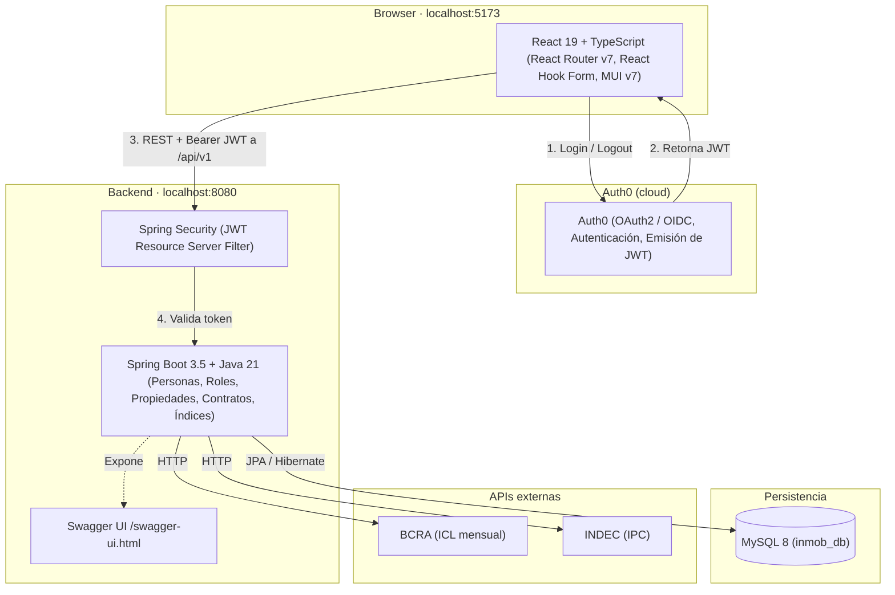

```mermaid
flowchart TB
    subgraph browser["Browser · localhost:5173"]
        FE["React 19 + TypeScript (React Router v7, React Hook Form, MUI v7)"]
    end

    subgraph auth0["Auth0 (cloud)"]
        A0["Auth0 (OAuth2 / OIDC, Autenticación, Emisión de JWT)"]
    end

    subgraph backend["Backend · localhost:8080"]
        SEC["Spring Security (JWT Resource Server Filter)"]
        API["Spring Boot 3.5 + Java 21 (Personas, Roles, Propiedades, Contratos, Índices)"]
        DOC["Swagger UI /swagger-ui.html"]
    end

    subgraph db["Persistencia"]
        MYSQL[("MySQL 8 (inmob_db)")]
    end

    subgraph external["APIs externas"]
        BCRA["BCRA (ICL mensual)"]
        INDEC["INDEC (IPC)"]
    end

    FE -- "1. Login / Logout" --> A0
    A0 -- "2. Retorna JWT" --> FE
    FE -- "3. REST + Bearer JWT a /api/v1" --> SEC
    SEC -- "4. Valida token" --> API
    API -- "JPA / Hibernate" --> MYSQL
    API -- "HTTP" --> BCRA
    API -- "HTTP" --> INDEC
    API -. "Expone" .-> DOC
```
