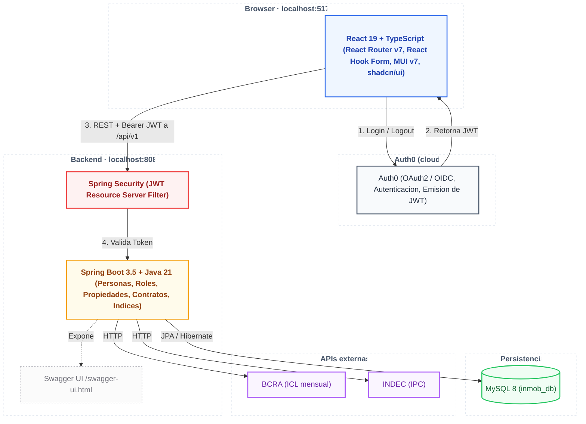

```mermaid
flowchart TB
    %% Theme and Global Configurations
    %% t=neutral
    
    subgraph browser["Browser · localhost:5173"]
        FE["React 19 + TypeScript (React Router v7, React Hook Form, MUI v7, shadcn/ui)"]
    end

    subgraph auth0["Auth0 (cloud)"]
        A0["Auth0 (OAuth2 / OIDC, Autenticacion, Emision de JWT)"]
    end

    subgraph backend["Backend · localhost:8080"]
        SEC["Spring Security (JWT Resource Server Filter)"]
        API["Spring Boot 3.5 + Java 21 (Personas, Roles, Propiedades, Contratos, Indices)"]
        DOC["Swagger UI /swagger-ui.html"]
    end

    subgraph db["Persistencia"]
        MYSQL[("MySQL 8 (inmob_db)")]
    end

    subgraph external["APIs externas"]
        BCRA["BCRA (ICL mensual)"]
        INDEC["INDEC (IPC)"]
    end

    %% Flow Connections
    FE -- "1. Login / Logout" --> A0
    A0 -- "2. Retorna JWT" --> FE
    FE -- "3. REST + Bearer JWT a /api/v1" --> SEC
    SEC -- "4. Valida Token" --> API
    API -- "JPA / Hibernate" --> MYSQL
    API -- "HTTP" --> BCRA
    API -- "HTTP" --> INDEC
    API -. "Expone" .-> DOC

    %% ==========================================
    %% LIGHT THEME VISUAL POLISHING (CSS)
    %% ==========================================
    
    %% 1. Node Class Definitions (Optimized for light backgrounds)
    classDef frontend fill:#eff6ff,stroke:#2563eb,stroke-width:2px,color:#1e40af,font-weight:bold,padding:10px;
    classDef security fill:#fef2f2,stroke:#ef4444,stroke-width:2px,color:#991b1b,font-weight:bold;
    classDef coreApi fill:#fffbeb,stroke:#f59e0b,stroke-width:2px,color:#92400e,font-weight:bold;
    classDef identity fill:#f8fafc,stroke:#475569,stroke-width:2px,color:#1e293b;
    classDef database fill:#f0fdf4,stroke:#22c55e,stroke-width:2px,color:#166534;
    classDef extApi fill:#faf5ff,stroke:#a855f7,stroke-width:2px,color:#6b21a8;
    classDef utility fill:#fbfbfb,stroke:#a1a1aa,stroke-width:1px,stroke-dasharray: 3,color:#71717a;

    %% 2. Assigning Classes to Nodes
    class FE frontend;
    class A0 identity;
    class SEC security;
    class API coreApi;
    class MYSQL database;
    class BCRA,INDEC extApi;
    class DOC utility;

    %% 3. Styling Subgraph Containers for Light Mode
    style browser fill:#ffffff,stroke:#e2e8f0,stroke-width:1px,stroke-dasharray: 4 4,color:#475569,font-weight:bold;
    style auth0 fill:#ffffff,stroke:#e2e8f0,stroke-width:1px,stroke-dasharray: 4 4,color:#475569,font-weight:bold;
    style backend fill:#ffffff,stroke:#e2e8f0,stroke-width:1px,stroke-dasharray: 4 4,color:#475569,font-weight:bold;
    style db fill:#ffffff,stroke:#e2e8f0,stroke-width:1px,stroke-dasharray: 4 4,color:#475569,font-weight:bold;
    style external fill:#ffffff,stroke:#e2e8f0,stroke-width:1px,stroke-dasharray: 4 4,color:#475569,font-weight:bold;
```
