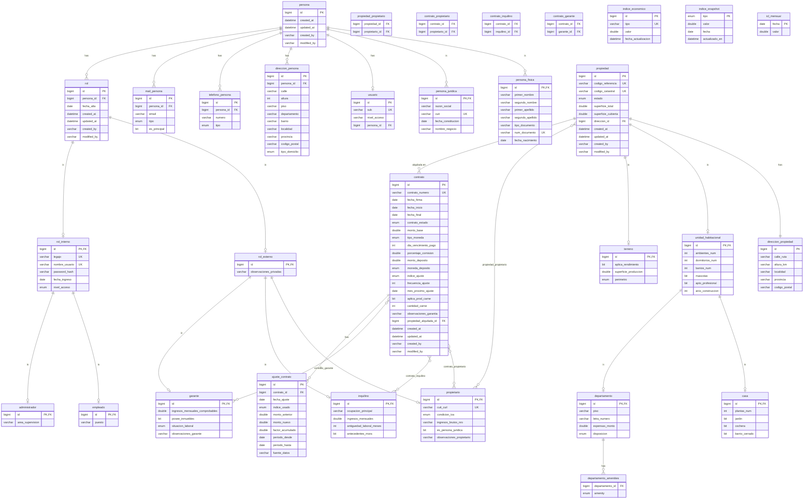

# inmob — Diagrama ER

```mermaid
erDiagram

    %% ── Persona ──────────────────────────────────────────────
    persona {
        bigint id PK
        datetime created_at
        datetime updated_at
        varchar created_by
        varchar modified_by
    }
    persona_fisica {
        bigint id PK, FK
        varchar primer_nombre
        varchar segundo_nombre
        varchar primer_apellido
        varchar segundo_apellido
        varchar tipo_documento
        varchar num_documento UK
        date fecha_nacimiento
    }
    persona_juridica {
        bigint id PK, FK
        varchar razon_social
        varchar cuit UK
        date fecha_constitucion
        varchar nombre_negocio
    }
    usuario {
        bigint id PK
        varchar sub UK
        varchar nivel_acceso
        bigint persona_id FK
    }
    direccion_persona {
        bigint id PK
        bigint persona_id FK
        varchar calle
        int altura
        varchar piso
        varchar departamento
        varchar barrio
        varchar localidad
        varchar provincia
        varchar codigo_postal
        enum tipo_domicilio
    }
    telefono_persona {
        bigint id PK
        bigint persona_id FK
        varchar numero
        enum tipo
    }
    mail_persona {
        bigint id PK
        bigint persona_id FK
        varchar email
        enum tipo
        bit es_principal
    }

    persona ||--o{ persona_fisica : "is"
    persona ||--o{ persona_juridica : "is"
    persona ||--o| usuario : "has"
    persona ||--o{ direccion_persona : "has"
    persona ||--o{ telefono_persona : "has"
    persona ||--o{ mail_persona : "has"

    %% ── Roles ────────────────────────────────────────────────
    rol {
        bigint id PK
        bigint persona_id FK
        date fecha_alta
        datetime created_at
        datetime updated_at
        varchar created_by
        varchar modified_by
    }
    rol_externo {
        bigint id PK, FK
        varchar observaciones_privadas
    }
    rol_interno {
        bigint id PK, FK
        varchar legajo UK
        varchar nombre_usuario UK
        varchar password_hash
        date fecha_ingreso
        enum nivel_acceso
    }
    propietario {
        bigint id PK, FK
        varchar cuit_cuil UK
        enum condicion_iva
        varchar ingresos_brutos_nro
        bit es_persona_juridica
        varchar observaciones_propietario
    }
    inquilino {
        bigint id PK, FK
        varchar ocupacion_principal
        double ingresos_mensuales
        int antiguedad_laboral_meses
        bit antecedentes_mora
    }
    garante {
        bigint id PK, FK
        double ingresos_mensuales_comprobables
        bit posee_inmuebles
        enum situacion_laboral
        varchar observaciones_garante
    }
    empleado {
        bigint id PK, FK
        varchar puesto
    }
    administrador {
        bigint id PK, FK
        varchar area_supervision
    }

    persona ||--o{ rol : "has"
    rol ||--o| rol_externo : "is"
    rol ||--o| rol_interno : "is"
    rol_externo ||--o| propietario : "is"
    rol_externo ||--o| inquilino : "is"
    rol_externo ||--o| garante : "is"
    rol_interno ||--o| empleado : "is"
    rol_interno ||--o| administrador : "is"

    %% ── Propiedad ────────────────────────────────────────────
    propiedad {
        bigint id PK
        varchar codigo_referencia UK
        varchar codigo_catastral UK
        enum estado
        double superficie_total
        double superficie_cubierta
        bigint direccion_id FK
        datetime created_at
        datetime updated_at
        varchar created_by
        varchar modified_by
    }
    direccion_propiedad {
        bigint id PK
        varchar calle_ruta
        varchar altura_km
        varchar localidad
        varchar provincia
        varchar codigo_postal
    }
    unidad_habitacional {
        bigint id PK, FK
        int ambientes_num
        int dormitorios_num
        int banios_num
        bit mascotas
        bit apto_profesional
        int anio_construccion
    }
    casa {
        bigint id PK, FK
        int plantas_num
        bit jardin
        bit cochera
        bit barrio_cerrado
    }
    departamento {
        bigint id PK, FK
        varchar piso
        varchar letra_numero
        double expensas_monto
        enum disposicion
    }
    departamento_amenities {
        bigint departamento_id FK
        enum amenity
    }
    terreno {
        bigint id PK, FK
        bit aplica_rendimiento
        double superficie_produccion
        enum perimetro
    }
    propiedad_propietario {
        bigint propiedad_id FK
        bigint propietario_id FK
    }

    propiedad ||--|| direccion_propiedad : "has"
    propiedad ||--o| unidad_habitacional : "is"
    propiedad ||--o| terreno : "is"
    unidad_habitacional ||--o| casa : "is"
    unidad_habitacional ||--o| departamento : "is"
    departamento ||--o{ departamento_amenities : "has"
    propiedad }o--o{ propietario : "propiedad_propietario"

    %% ── Contrato ─────────────────────────────────────────────
    contrato {
        bigint id PK
        varchar contrato_numero UK
        date fecha_firma
        date fecha_inicio
        date fecha_final
        enum contrato_estado
        double monto_base
        enum tipo_moneda
        int dia_vencimiento_pago
        double porcentaje_comision
        double monto_deposito
        enum moneda_deposito
        enum indice_ajuste
        int frecuencia_ajuste
        date mes_proximo_ajuste
        bit aplica_prod_carne
        int cantidad_carne
        varchar observaciones_garantia
        bigint propiedad_alquilada_id FK
        datetime created_at
        datetime updated_at
        varchar created_by
        varchar modified_by
    }
    contrato_propietario {
        bigint contrato_id FK
        bigint propietario_id FK
    }
    contrato_inquilino {
        bigint contrato_id FK
        bigint inquilino_id FK
    }
    contrato_garante {
        bigint contrato_id FK
        bigint garante_id FK
    }
    ajuste_contrato {
        bigint id PK
        bigint contrato_id FK
        date fecha_ajuste
        enum indice_usado
        double monto_anterior
        double monto_nuevo
        double factor_acumulado
        date periodo_desde
        date periodo_hasta
        varchar fuente_datos
    }

    propiedad ||--o{ contrato : "alquilada en"
    contrato }o--o{ propietario : "contrato_propietario"
    contrato }o--o{ inquilino : "contrato_inquilino"
    contrato }o--o{ garante : "contrato_garante"
    contrato ||--o{ ajuste_contrato : "has"

    %% ── Índices económicos ───────────────────────────────────
    indice_economico {
        bigint id PK
        varchar tipo UK
        double valor
        datetime fecha_actualizacion
    }
    indice_snapshot {
        enum tipo PK
        double valor
        date fecha
        datetime actualizado_en
    }
    icl_mensual {
        date fecha PK
        double valor
    }
```
