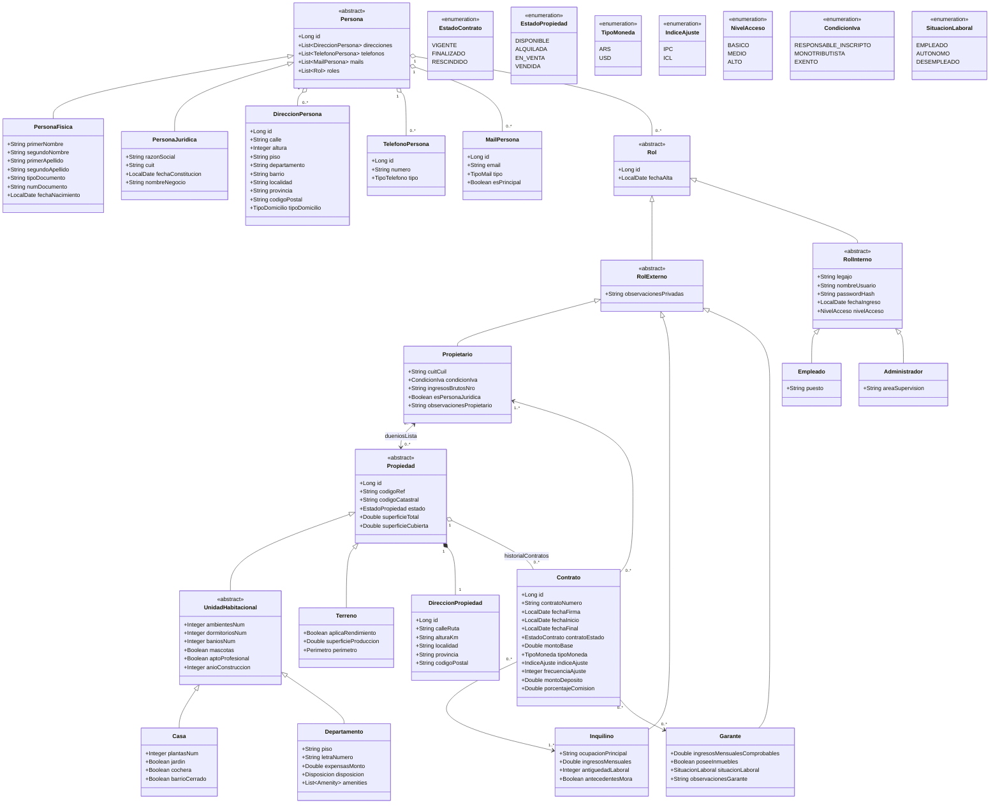

# inmob — Diagrama de Clases UML

```mermaid
classDiagram
    %% ── Persona ──────────────────────────────────────────────
    class Persona {
        <<abstract>>
        +Long id
        +List~DireccionPersona~ direcciones
        +List~TelefonoPersona~ telefonos
        +List~MailPersona~ mails
        +List~Rol~ roles
    }
    class PersonaFisica {
        +String primerNombre
        +String segundoNombre
        +String primerApellido
        +String segundoApellido
        +String tipoDocumento
        +String numDocumento
        +LocalDate fechaNacimiento
    }
    class PersonaJuridica {
        +String razonSocial
        +String cuit
        +LocalDate fechaConstitucion
        +String nombreNegocio
    }

    Persona <|-- PersonaFisica
    Persona <|-- PersonaJuridica

    %% ── Contacto ─────────────────────────────────────────────
    class DireccionPersona {
        +Long id
        +String calle
        +Integer altura
        +String piso
        +String departamento
        +String barrio
        +String localidad
        +String provincia
        +String codigoPostal
        +TipoDomicilio tipoDomicilio
    }
    class TelefonoPersona {
        +Long id
        +String numero
        +TipoTelefono tipo
    }
    class MailPersona {
        +Long id
        +String email
        +TipoMail tipo
        +Boolean esPrincipal
    }

    Persona "1" o-- "0..*" DireccionPersona
    Persona "1" o-- "0..*" TelefonoPersona
    Persona "1" o-- "0..*" MailPersona

    %% ── Roles ────────────────────────────────────────────────
    class Rol {
        <<abstract>>
        +Long id
        +LocalDate fechaAlta
    }
    class RolExterno {
        <<abstract>>
        +String observacionesPrivadas
    }
    class RolInterno {
        <<abstract>>
        +String legajo
        +String nombreUsuario
        +String passwordHash
        +LocalDate fechaIngreso
        +NivelAcceso nivelAcceso
    }
    class Propietario {
        +String cuitCuil
        +CondicionIva condicionIva
        +String ingresosBrutosNro
        +Boolean esPersonaJuridica
        +String observacionesPropietario
    }
    class Inquilino {
        +String ocupacionPrincipal
        +Double ingresosMensuales
        +Integer antiguedadLaboral
        +Boolean antecedentesMora
    }
    class Garante {
        +Double ingresosMensualesComprobables
        +Boolean poseeInmuebles
        +SituacionLaboral situacionLaboral
        +String observacionesGarante
    }
    class Empleado {
        +String puesto
    }
    class Administrador {
        +String areaSupervision
    }

    Persona "1" o-- "0..*" Rol
    Rol <|-- RolExterno
    Rol <|-- RolInterno
    RolExterno <|-- Propietario
    RolExterno <|-- Inquilino
    RolExterno <|-- Garante
    RolInterno <|-- Empleado
    RolInterno <|-- Administrador

    %% ── Propiedad ────────────────────────────────────────────
    class Propiedad {
        <<abstract>>
        +Long id
        +String codigoRef
        +String codigoCatastral
        +EstadoPropiedad estado
        +Double superficieTotal
        +Double superficieCubierta
    }
    class UnidadHabitacional {
        <<abstract>>
        +Integer ambientesNum
        +Integer dormitoriosNum
        +Integer baniosNum
        +Boolean mascotas
        +Boolean aptoProfesional
        +Integer anioConstruccion
    }
    class Casa {
        +Integer plantasNum
        +Boolean jardin
        +Boolean cochera
        +Boolean barrioCerrado
    }
    class Departamento {
        +String piso
        +String letraNumero
        +Double expensasMonto
        +Disposicion disposicion
        +List~Amenity~ amenities
    }
    class Terreno {
        +Boolean aplicaRendimiento
        +Double superficieProduccion
        +Perimetro perimetro
    }
    class DireccionPropiedad {
        +Long id
        +String calleRuta
        +String alturaKm
        +String localidad
        +String provincia
        +String codigoPostal
    }

    Propiedad <|-- UnidadHabitacional
    Propiedad <|-- Terreno
    UnidadHabitacional <|-- Casa
    UnidadHabitacional <|-- Departamento
    Propiedad "1" *-- "1" DireccionPropiedad

    %% ── Contrato ─────────────────────────────────────────────
    class Contrato {
        +Long id
        +String contratoNumero
        +LocalDate fechaFirma
        +LocalDate fechaInicio
        +LocalDate fechaFinal
        +EstadoContrato contratoEstado
        +Double montoBase
        +TipoMoneda tipoMoneda
        +IndiceAjuste indiceAjuste
        +Integer frecuenciaAjuste
        +Double montoDeposito
        +Double porcentajeComision
    }

    Propiedad "1" o-- "0..*" Contrato : historialContratos
    Propietario "0..*" <--> "0..*" Propiedad : dueniosLista
    Contrato "0..*" --> "1..*" Propietario
    Contrato "0..*" --> "1..*" Inquilino
    Contrato "0..*" --> "0..*" Garante

    %% ── Enums ────────────────────────────────────────────────
    class EstadoContrato {
        <<enumeration>>
        VIGENTE
        FINALIZADO
        RESCINDIDO
    }
    class EstadoPropiedad {
        <<enumeration>>
        DISPONIBLE
        ALQUILADA
        EN_VENTA
        VENDIDA
    }
    class TipoMoneda {
        <<enumeration>>
        ARS
        USD
    }
    class IndiceAjuste {
        <<enumeration>>
        IPC
        ICL
    }
    class NivelAcceso {
        <<enumeration>>
        BASICO
        MEDIO
        ALTO
    }
    class CondicionIva {
        <<enumeration>>
        RESPONSABLE_INSCRIPTO
        MONOTRIBUTISTA
        EXENTO
    }
    class SituacionLaboral {
        <<enumeration>>
        EMPLEADO
        AUTONOMO
        DESEMPLEADO
    }
```
